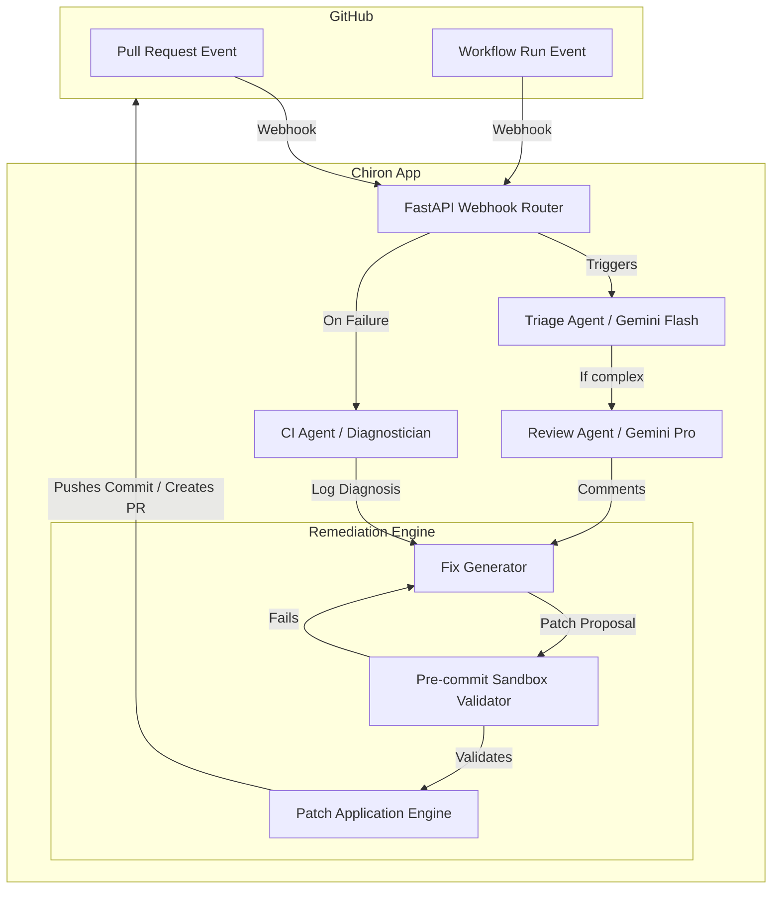

<div align="center">
  
  <h1>Chiron</h1>
  <p><b>Autonomous CI/CD Code Review & Remediation Agent</b></p>

  [](https://www.python.org/downloads/)
  [](https://opensource.org/licenses/MIT)
  [](https://github.com/astral-sh/ruff)
</div>

<br/>

**Chiron** is an autonomous GitHub App that doesn't just review your pull requests—it actively monitors your CI/CD pipelines, diagnoses test or linting failures, and automatically writes and tests the code to fix them. Powered by Google Gemini and built on FastAPI.

## ✨ Features

- 🕵️‍♂️ **Intelligent PR Review**: Multi-dimensional analysis (correctness, performance, security) using Google Gemini 2.5.
- 🛠️ **Autonomous Remediation**: Automatically generates precise patch blocks to fix detected issues or CI failures.
- 🔄 **Self-Correction Sandbox**: Validates patches using Python AST and Ruff *before* applying them, running a loop of fix → test → retry.
- 🔀 **Flexible Branching**: Choose to push fixes directly to the working branch or create an isolated "Chiron Fix" pull request for human review.
- ⚡ **Async Native**: Built with FastAPI and githubkit for high-performance webhook processing.

## 🏗 Architecture



## 🚀 Quick Start

### 1. Install Dependencies
Chiron requires Python 3.12+. We recommend using a virtual environment.
```bash
python -m venv venv
source venv/bin/activate
pip install -e '.[dev]'
```

### 2. Configure Environment
Copy `.env.example` to `.env` and fill in your GitHub App credentials and Gemini API key.
```bash
cp .env.example .env
```

### 3. Run Locally
```bash
make dev
```
Alternatively, use Docker Compose:
```bash
make docker-up
```

## ⚙️ Repository Configuration

To enable Chiron on a specific repository, place a `.chiron.yml` file in the root of that repository.

```yaml
version: "1.0"
fix_strategy: "branch"        # options: "direct", "branch"
review_timeout_seconds: 300
ci_monitoring: true           # Enable/disable workflow monitoring
```

## 📚 Documentation

For more information on hosting and showcasing Chiron, check out the docs:
- [Deployment Guide](docs/DEPLOYMENT.md) - Hosting on Cloud Run / Vercel.
- [Portfolio Demo Guide](docs/PORTFOLIO_DEMO.md) - Setting up a live demo repository.

## 🐴 Why "Chiron"?

Named after Chiron, the wise centaur of Greek mythology who mentored heroes like Achilles and Heracles. This agent acts as a wise, patient mentor for your codebase—not just pointing out flaws, but teaching you how to fix them.

## 📄 License

MIT © 2026 Edwin Gigi
